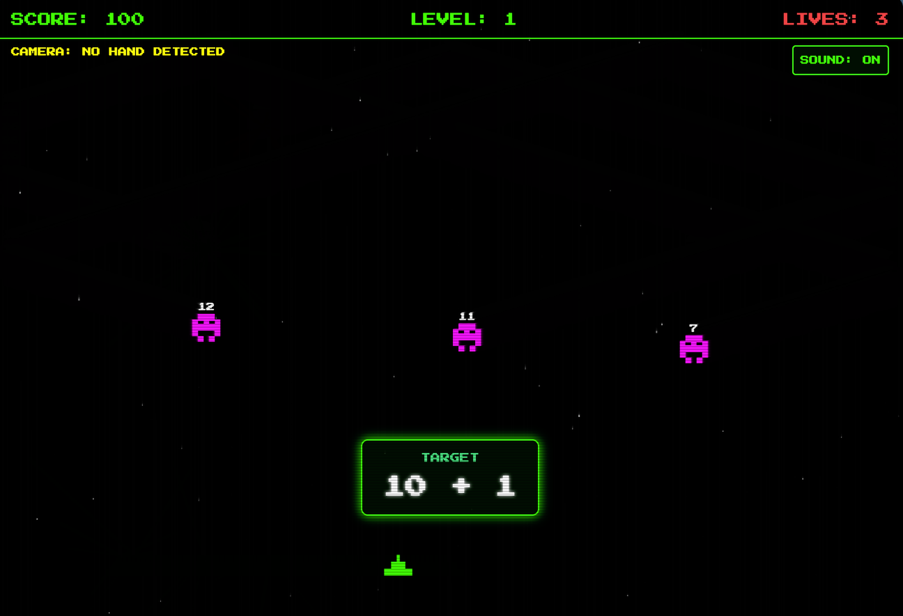

# Math Invaders

A retro Space Invaders–style game that blends arcade shooting with arithmetic practice. A math problem appears at the top of the screen — shoot the alien holding the correct answer to progress.

## 📸 Screenshot



## 🔗 Live Site
Play it at: [https://drhycheung.github.io/MathInvaders](https://drhycheung.github.io/MathInvaders)

## 🎮 Gameplay
- A math expression (e.g. `? + ?`) is shown at the top of the screen
- Aliens descend carrying different answer values
- Shoot the alien with the **correct answer** to score
- Answering wrong (or letting an alien through) costs points/health
- Difficulty and the math level increase as you advance

## 🕹️ Controls
- **Keyboard:** Arrow keys to move, Space to shoot
- **Touch:** On-screen controls on mobile
- **Hand tracking:** Move by moving your hand; raise a finger to shoot (uses your webcam)

## ✨ Features
- Increasing difficulty across levels
- Retro pixel-art look with a classic arcade font
- Score and level tracking with a final result screen
- Hand-gesture control via [MediaPipe Hands](https://developers.google.com/mediapipe/solutions/vision/hand_landmarker)

## 🛠️ Built With
- Vanilla JavaScript + HTML5 Canvas
- [Tailwind CSS](https://tailwindcss.com) (CDN)
- [MediaPipe Hands](https://developers.google.com/mediapipe/solutions/vision/hand_landmarker) for gesture control
- Hosted on [GitHub Pages](https://pages.github.com)

## 🚀 Local Development
Open `index.html` in a browser, or serve it locally:

```bash
python3 -m http.server 8000
```

Then visit http://localhost:8000.
