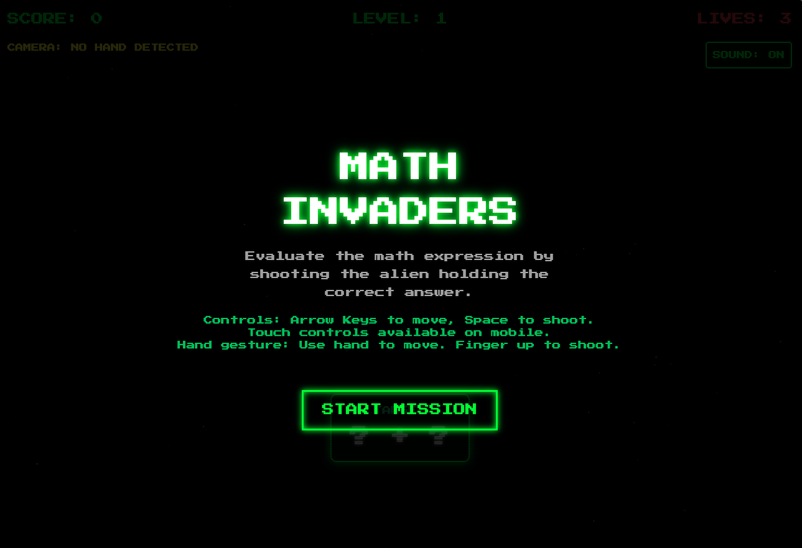
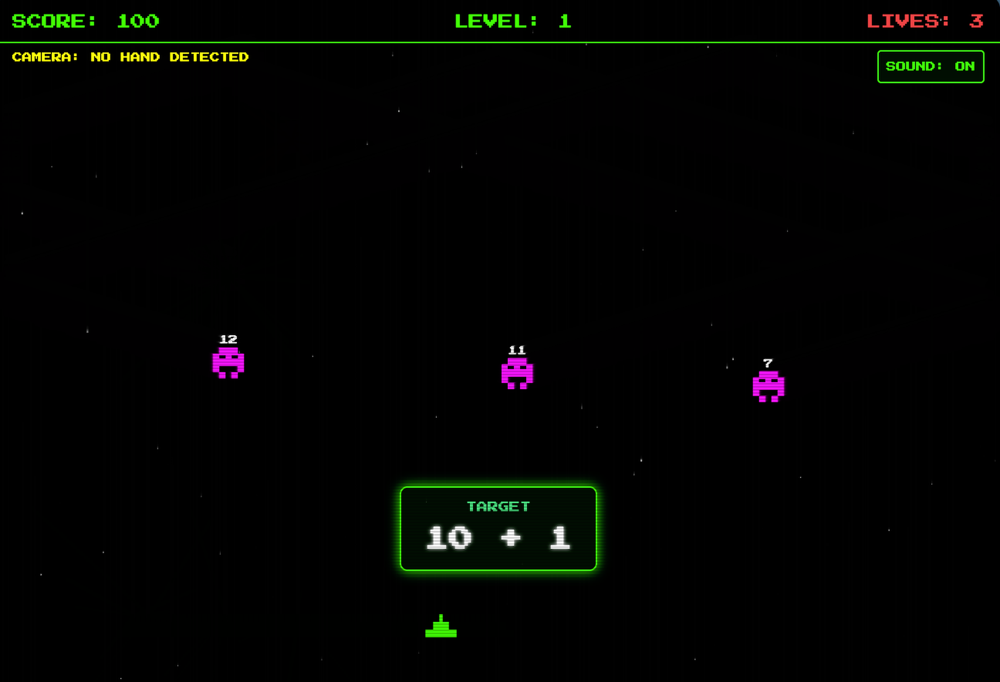

# Math Invaders: Gamified Arithmetic Practice (EdTech Teaching Demo)

**Live demo (GitHub Pages): https://drhycheung.github.io/MathInvaders/**

A retro Space Invaders–style game that blends arcade shooting with arithmetic practice. A math problem appears at the bottom of the screen — shoot the alien holding the correct answer to progress. Built as a single-file, front-end-only EdTech demo for classroom discussion on motivation and game-based learning.

File: `index.html` — no build step, no backend. Open it in a browser or deploy to GitHub Pages.

---

## 1. Where this project fits: Motivation through gamification

Many students lack motivation for practising arithmetic. Repetitive drills can feel tedious, leading to disengagement and low retention. Gamification addresses this by tapping into intrinsic and extrinsic motivators: challenge, feedback, progression and reward.

This project turns abstract number practice into a fast-paced arcade task (shoot the correct answer) to:
- **Capture attention**: The familiar Space Invaders format lowers the barrier to participation.
- **Create flow**: Timed responses and increasing difficulty provide an appropriate challenge level.
- **Provide immediate feedback**: Correct/incorrect hits give instant feedback on mathematical decisions.
- **Motivate through progression**: Levels, scoring and health create a sense of accomplishment.
- **Encourage repeated practice**: The game loop naturally invites "just one more round", increasing deliberate practice opportunities.

---

## 2. What the game does

| Feature | Implementation |
|---|---|
| Interactive arcade gameplay | HTML5 Canvas + vanilla JavaScript; sprite movement, collision detection and wave spawning |
| Dynamic math problems | Randomly generated arithmetic expressions appear at the bottom of the screen |
| Target selection under pressure | Aliens descend carrying different answer values; players must identify and shoot the correct answer |
| Progressive difficulty | Difficulty ramps up as levels advance (faster aliens, more targets, varied problem sets) |
| Scoring and lives | Score and health tracking with a final result screen |
| Retro pixel art | Classic arcade styling with pixel font |
| Multiple input modes | Keyboard (Arrow keys + Space), touch controls on mobile, and hand-gesture control via webcam |
| Hand-gesture control | [MediaPipe Hands](https://developers.google.com/mediapipe/solutions/vision/hand_landmarker) for moving the cannon and triggering shots |

---

## 3. Design decisions: Technology choices

| Decision | Rationale |
|---|---|
| Vanilla JavaScript (no framework) | Keeps the code transparent for teaching; students can read and modify logic without framework overhead |
| Single-file `index.html` | Easy to share, open directly in browser, and deploy to GitHub Pages with zero configuration |
| HTML5 Canvas | Lightweight, performant for arcade sprites and simple collision detection |
| Tailwind CSS (CDN) | Rapid UI styling for HUD, overlays and mobile controls without a build step |
| MediaPipe Hands (CDN) | Demonstrates multimodal interaction (hand tracking) to spark discussion on accessibility and alternative inputs |

---

## 4. How to run

- **Locally (no server needed):** Double-click `index.html` in any modern browser.
- **Locally with server:** `python3 -m http.server 8000` then open `http://localhost:8000/`. Useful if you prefer serving over HTTP.
- **GitHub Pages (your own deployment):** Push `index.html` and images to your GitHub repository, then enable Pages via **Settings → Pages → Deploy from a branch** (select branch and `/ (root)`). Your game will be live at `https://<your-username>.github.io/<repo-name>/`.

Desktop and mobile are supported. Hand tracking requires a webcam and works best in well-lit conditions.

---

## 5. Known limitations

| Limitation | Consequence |
|---|---|
| Simple arithmetic scope | Currently focuses on basic arithmetic (suitable for primary/early secondary practice). Advanced operations would require extending the problem generator |
| Model-free difficulty curve | Difficulty increases heuristically (speed, spawn rate). Could be better calibrated to student performance |
| Gesture mode constraints | Hand tracking depends on lighting, camera quality and browser permissions; it may be less responsive than keyboard/touch |
| Canvas-only rendering | No accessibility features for screen readers (game state is primarily visual/auditory). Consider adding text alternatives if adapting for accessibility needs |
| Browser compatibility | Requires a modern browser with WebGL/Camera API support for MediaPipe and proper Canvas rendering |

---

## 6. Documentation

| Document | What it covers |
|---|---|
| **[Vibe-coding guide](docs/vibe-coding.md)** | Design thinking behind this project, how it was built with an AI coding tool, and a complete prompt to reproduce it for classroom use |

---

## 7. Licences and attribution

- Built with [MediaPipe Hands](https://developers.google.com/mediapipe/solutions/vision/hand_landmarker) by Google.
- Styled with [Tailwind CSS](https://tailwindcss.com).
- Game concept inspired by the classic Space Invaders arcade game.
- Hosted on [GitHub Pages](https://pages.github.com).

All original code in this repository is available under standard educational use. Attribution appreciated when reusing for teaching.